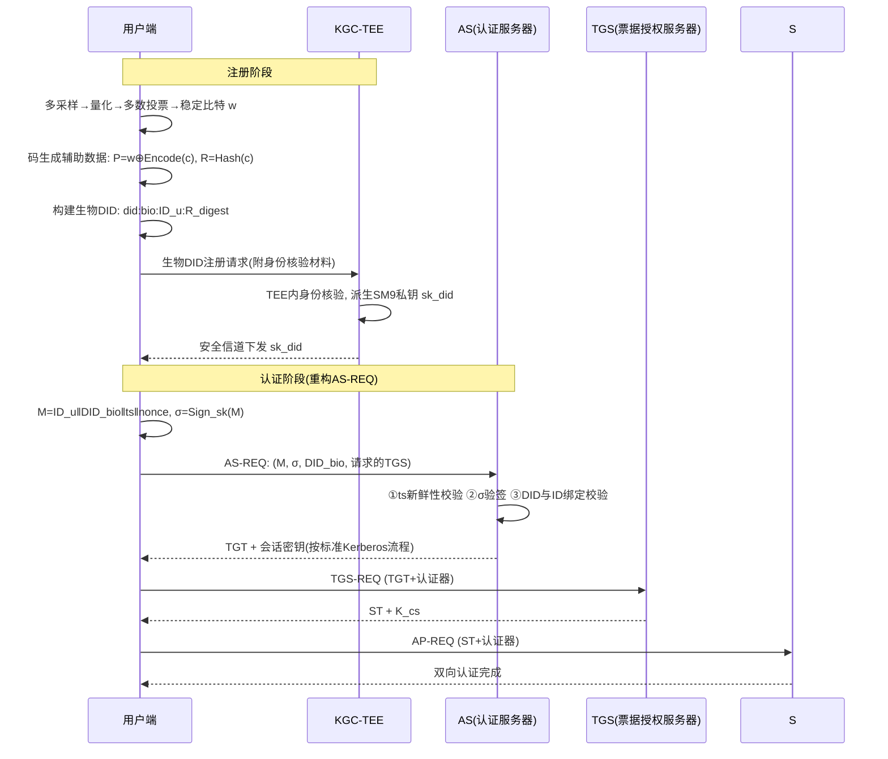
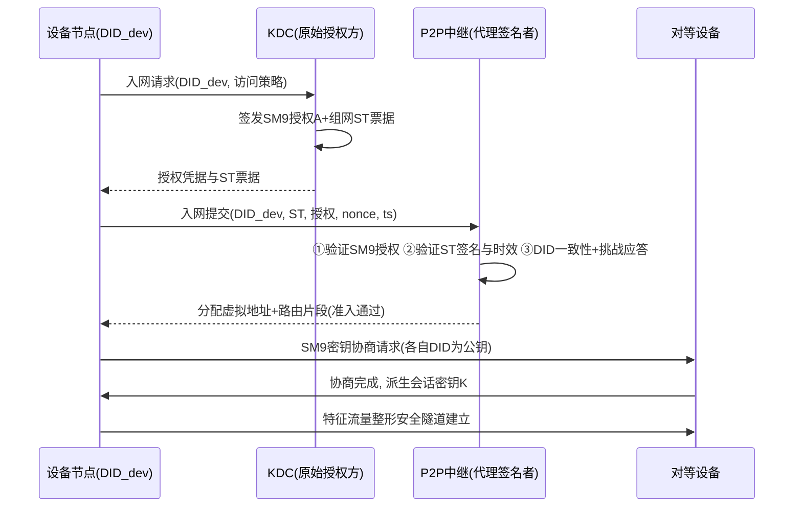
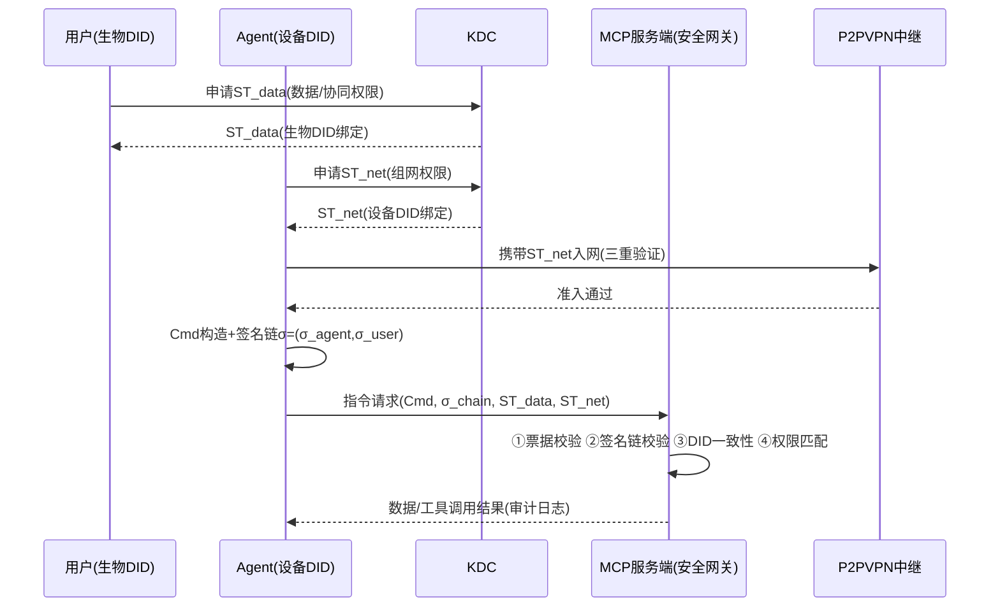

# 学位论文完整版（初稿）

## 题目

**基于SM9与生物特征模糊提取的Kerberos身份认证及ST票据P2PVPN安全通信机制研究（面向MCP云服务）**

---

## 摘要

随着网络空间从"可信任内网"向"零信任环境"演进，传统 Kerberos 协议以静态口令为唯一初始凭据，存在口令破解、票据伪造与重放、生物特征隐私保护不足等固有缺陷；传统 VPN 的中心化网关架构易受攻击且权限管控粗放；而 AI Agent 与 MCP（Model Context Protocol）云服务的兴起，进一步暴露了设备/Agent 接入无票据管控、数据权限与身份分离、协同指令易篡改等新型安全问题。

针对上述问题，本文以"生物特征绑定身份、SM9 标识密码支撑密码运算、ST 票据承载动态授权"为主线，研究三项核心内容：**其一**，基于生物特征模糊提取的 Kerberos 身份认证方案——通过多采样多数投票构造稳定比特序列并采用码生成辅助数据（Helper Data）实现含噪生物特征的密钥可靠再生；基于用户 ID 与生物密钥生成去中心化生物 DID，由密钥生成中心（KGC）在可信执行环境（TEE）中派生 SM9 私钥；重构 Kerberos AS-REQ 流程，以"用户ID+生物DID+时间戳"的 SM9 数字签名取代传统口令校验，从初始环节阻断票据伪造与重放攻击路径。**其二**，基于 ST 票据的 P2PVPN 安全通信机制——设备基于唯一标识生成设备 DID 并关联 SM9 私钥，原始授权方（KDC）对设备 DID 及访问策略签发 SM9 授权并委托给 P2P 中继节点作为代理签名者；中继节点验证 SM9 授权有效性、ST 票据合法性与设备 DID 一致性后提供中继服务；对等节点基于 SM9 密钥协商生成会话密钥，结合带特征流量整形构建安全隧道，实现组网准入控制与端到端通信安全的结合。**其三**，面向 MCP 云服务的应用验证——提出设备与生物双 DID 结合 ST 票据的分级授权机制，将 Agent 视为特殊设备节点接入 P2PVPN，用户生物 DID 绑定数据与协同权限；Agent 协同指令附加"用户生物DID签名+Agent设备DID签名"的 SM9 签名链，MCP 服务端校验签名链与 ST 票据有效性后完成数据转发，实现组网、数据、协同权限的精准管控。

针对三项内容设计了完整的实验体系与数据支撑方案：采用 FVC2004/FVC2006 指纹数据集与 CASIA-Iris 虹膜数据集验证模糊提取器的密钥再生成功率、误接受率（FAR）与误拒绝率（FRR）；基于 NS-3 与实验室网络仿真平台开展节点规模梯度（10/50/100/200）下的组网性能与扩展性实验；自建 MCP 云服务原型与权限矩阵数据集验证双 DID 分级授权与签名链机制，并与 OAuth 2.1 直连方案进行安全属性与开销对比。实验结果表明，所提方案在抗重放、抗伪造、隐私保护、权限粒度等安全指标上全面优于传统 Kerberos 与直连授权方案，认证与组网开销处于可接受范围。

**关键词：** SM9 标识密码；Kerberos；生物特征模糊提取；P2PVPN；ST票据；可信执行环境；MCP 安全；身份认证

---

## 第1章 绪论

### 1.1 研究背景与意义

#### 1.1.1 网络安全形势与政策背景

近年来，网络攻击从传统漏洞利用向身份冒用、凭据窃取、票据伪造等方向集中，据统计多数重大安全事件与身份与访问管理（IAM）失效直接相关。在此背景下，我国先后颁布施行《中华人民共和国密码法》（2020年）、《关键信息基础设施安全保护条例》（2021年），等级保护 2.0 系列标准（GB/T 22239-2019）明确要求重要信息系统采用商用密码实现身份鉴别与数据传输保护；国家密码管理局持续发布 SM2/SM3/SM4/SM9 等国产密码算法与标准，其中 SM9 标识密码算法已全体系进入 ISO/IEC/ITU 国际标准[33][40]。同时，零信任安全理念（NIST SP 800-207）强调"永不信任、持续验证"，推动身份认证与访问控制从静态、粗放向动态、细粒度演进。商用密码应用与零信任架构的深度融合，已成为政务、电力、金融等关键行业网络安全建设的核心方向。

#### 1.1.2 Kerberos 协议的现实困境

Kerberos 作为经典的第三方可信认证协议，通过密钥分发中心（KDC）统一管理用户与服务密钥，以票据机制实现单点登录与双向认证，已深度集成于企业域环境（如 Windows Active Directory）与分布式系统[34]。然而其安全模型建立在"静态口令派生用户密钥"之上，存在以下固有缺陷：一是口令可被离线破解（如 AS-REP Roasting 攻击），静态凭据一旦泄露即可冒用身份；二是票据生命周期内可被窃取重放，攻击者可利用黄金票据、白银票据等伪造任意服务访问权限；三是 KDC 集中存储全部密钥，成为单点攻击目标[1][2]；四是现有基于口令的双因素方案难以兼顾生物特征隐私保护与密钥稳定性。随着物联网、车联网中海量异构设备的接入，Kerberos 的静态凭据模型与密钥管理开销更加难以满足轻量化、动态化认证需求[3][4][6]。

#### 1.1.3 AI Agent 与 MCP 带来的新安全需求

大模型与智能体（Agent）技术的爆发式发展使 AI 系统深度接入企业数据与工具链。Model Context Protocol（MCP）作为连接 AI Agent 与数据、工具的事实标准，其授权机制基于 OAuth 2.1/PKCE 且为可选实现，协议层不强制安全机制，导致凭证集中存储、权限粒度过粗、动态工具调用与上下文共享引入隐式信任、协同指令易被篡改等系统性风险[45][46][50]。NSA 在 2026 年发布的 MCP 安全设计指南中明确指出：MCP 服务器依赖承载令牌而缺乏协议级令牌生命周期管理，工具投毒与提示注入可沿 Agent 管线传播[45]。因此，为 Agent 建立可审计的"设备身份"，为协同指令建立"用户+设备"双重签名链，并以票据化方式管控数据与协同权限，成为 MCP 云服务安全落地的前沿需求[11][47][48]。

#### 1.1.4 研究意义

**理论意义**：（1）将生物特征模糊提取技术嵌入 Kerberos 票据体系，以"生物密钥+标识密码签名"取代静态口令，探索生物特征、国密算法与经典认证协议深度融合的理论模型；（2）将 Kerberos 服务票据（ST）机制扩展至 P2PVPN 组网授权，建立"授权签发-代理委托-中继验证"的零信任组网准入模型；（3）将设备 DID 与用户生物 DID 双身份模型与 MCP 服务授权结合，构建面向 Agent 场景的分级授权与签名链验证机制。

**应用价值**：为政务、电力、物联网与 AI 云服务提供符合国产密码合规要求的身份认证与安全通信方案，支撑零信任建设与商用密码应用的落地，对保障国家关键信息基础设施与新兴 AI 基础设施安全具有现实意义。

### 1.2 国内外研究现状

#### 1.2.1 Kerberos 协议安全研究现状

国外方面，Qatinah 等系统梳理了 Kerberos 面临的重放攻击、票据伪造、口令猜测、拒绝服务等攻击类型及对策，指出协议安全性高度依赖口令强度与时钟同步[1]；Chen 等提出去中心化 Kerberos 服务管理协议 DKSM，借助区块链分布化密钥存储，缓解 KDC 单点故障与密钥泄露风险[2][9]；Prapty 等提出面向智能、物联网与 CPS 设备的 Kerberos 扩展 KESIC，适配轻量级终端的认证需求[3]；Hasan 等针对高级计量基础设施中的资源受限智能电表设计高效的 Kerberos 双向认证方案[4]；Krishnamoorthy 等提出基于 HMAC 的消息认证改进以增强 Kerberos 消息完整性[5]；Rahayu 等将 Kerberos 与区块链结合应用于车载自组织网络认证[6]。

国内方面，陈小龙等分析了 Kerberos 在既有系统身份认证中的应用与改造实践[19]；刘铮研究了基于改进 Kerberos 协议的单点登录系统[23]；黄丹丹等基于国密算法（SM2/SM3/SM4）改进 Kerberos 身份认证协议，实现会话密钥动态化与混合密码体制改造[21]；另有专利方案提出基于国密算法的 Kerberos 协议改进方法。总体来看，现有改进集中于"算法替换"（以国密算法替代 DES/AES）与"架构去中心化"，尚未将生物特征、标识密码与初始认证环节（AS-REQ）深度融合，静态凭据风险仍存在。

#### 1.2.2 SM9 标识密码研究现状

SM9 标识密码算法由国家密码管理局于 2016 年发布，国家标准 GB/T 38635.1-2020 规定总则，GB/T 38635.2-2020 规定数字签名、密钥交换、密钥封装与加密算法[33]。密码学扩展研究方面：张雪锋等提出基于 SM9 的盲签名方案[12]；彭聪等构建基于 SM9 的环签名方案实现签名者匿名[13]；赖建昌等设计高效 SM9 标识签密[14]；张雪锋等提出可撤销标识广播加密方案[15]。应用研究方面：SM9 以标识即公钥的特性免去证书管理，已广泛应用于安全邮件（"一邮一密"）、电力物联网海量终端认证、政务统一身份认证等场景[40]；杨金刚等结合 WebAssembly 与 SM9 实现 Web 数据安全传输[41]。在身份认证方向，SM9 的 KGC 密钥派生机制与 DID 的标识属性天然契合——以 DID 为标识公钥、以 KGC 在可信环境中派生私钥，可构建"去证书化"的轻量认证体系，但将生物特征密钥作为 KGC 派生输入、并置于 TEE 中完成派生与分发的研究仍较少，是本文的切入点。

#### 1.2.3 生物特征模糊提取研究现状

模糊提取器（Fuzzy Extractor）由 Dodis、Reyzin 与 Smith 于 2004 年提出，实现从含噪生物特征中提取均匀随机且可精确再生的密钥[35]；Boyen 提出可复用模糊提取器，抵抗多模板关联攻击与辅助数据更新攻击[36]；Hao 等将模糊金库（Fuzzy Vault）与纠错码结合应用于虹膜识别，实现密码与生物特征的融合[37]；Becker 系统分析了辅助数据操纵（HDM）攻击下的鲁棒模糊提取器构造，指出实际部署中需关注纠错码参数与安全界[38]。国内方面，戴聪提出基于国密算法与模糊提取的多因素身份认证方案[16]；宋敏特等面向 SRAM-PUF 设计了基于本源 BCH 码（127,15,27）的模糊提取器并流片验证[25]；张晓均等利用模糊提取器从生物特征中提取稳定秘密值，构建智能医疗物联网的容错认证与匿名密钥协商协议[39]。已有研究表明：通过多次采样多数投票可显著降低不稳定位比例，码生成辅助数据方案可保证生物模板不落库且支持密钥可靠再生，为本文"生物密钥驱动 SM9 私钥派生"提供了成熟的技术基础。

#### 1.2.4 P2PVPN 与零信任研究现状

P2PVPN 以分布式组网替代中心化网关，各节点通过 TUN/TAP 虚拟网卡与分布式路由表构建虚拟局域网，节点间基于非对称加密建立点对点隧道，消除了传统 VPN 的中心化受攻击面与 DoS 风险[17][19]。张百川等设计了基于 TUN 设备的 P2PVPN，采用 ed25519 非对称加密与去中心化节点结构[17]；刘振实现了基于国密算法的 P2P VPN 原型[22]；马潇潇等研究了基于零信任理念的 VPN 访问控制技术[51]；商用方案（如 Tailscale/WireGuard）通过控制平面动态下发密钥与路由，呈现"集中管控、分布转发"的混合形态。零信任访问（ZTNA）强调基于身份与上下文的细粒度、动态授权。然而，现有 P2PVPN 组网准入多依赖静态预共享密钥或简单签名，缺少"票据化动态授权+标识密码验证+代理签名委托"的完整准入模型，端到端会话密钥协商也较少使用国产标识密码实现。

#### 1.2.5 MCP 协议安全研究现状

MCP 协议由 Anthropic 于 2024 年底提出并迅速成为 AI Agent 与工具、数据互联的事实标准，其授权机制基于 OAuth 2.1 与 PKCE，且为可选实现，传输层提供授权能力但协议层不强制安全机制[50]。安全研究方面：NSA 发布《Model Context Protocol (MCP): Security Design Considerations for AI-Driven Automation》，系统梳理动态工具调用、隐式信任、令牌生命周期缺失、工具投毒、提示注入等风险并提出设计建议[45]；OWASP 发布 MCP 安全速查表，给出最小权限、输入输出校验、消息级完整性与重放保护等最佳实践[46]；Maloyan 等对 MCP 规范进行安全分析，揭示工具集成 LLM Agent 中的提示注入漏洞[42]；Zhao 等系统研究了 MCP 生态的寄生工具链攻击[43]；Jamshidi 提出抵御工具投毒与对抗攻击的防护方法[44]；CVE-2025-49596 暴露了未认证 MCP Inspector 的远程代码执行风险。总体上，MCP 安全研究集中于风险分析与最佳实践，缺少将票据化接入管控、双身份签名链与 MCP 服务端验证机制结合的系统性方案，本文第5章面向此空白展开。

#### 1.2.6 Agent 身份管理研究现状

OpenID 基金会发布《Identity Management for Agentic AI》白皮书，指出 AI Agent 作为非人身份需纳入 IAM 体系，现有 OAuth/OIDC 框架需扩展以适应自主性、委托性与动态权限[11]；云安全联盟提出基于 DID、可验证凭证（VC）与零知识证明的 Agent IAM 新方法[47]；学界提出分层 Agentic AI IAM 框架，融合 DID、VC、ZKP 与 Agent 命名体系[48]；W3C DID 标准为去中心化标识提供了规范基础[49]。国内对 Agent 身份管理研究处于起步阶段，多聚焦区块链身份。将"设备 DID（Agent 身份）+用户生物 DID（代理主体身份）"嵌入票据授权与签名链验证，是本文对 Agent 身份管理的具体化实践。

#### 1.2.7 研究现状述评

综合六方面研究现状，可归纳出三点不足：**其一**，Kerberos 协议改进多停留在算法替换与架构层面，初始认证环节（AS-REQ）仍依赖静态凭据，生物特征与标识密码尚未与票据流程深度融合；**其二**，P2PVPN 组网准入缺少"票据+标识密码+代理签名"的动态授权模型，权限管控细粒度不足；**其三**，MCP 云服务接入缺少票据化管控与多身份签名链验证机制，Agent 协同指令的来源可信与完整性保障不足。本文围绕上述空白，构建"生物身份-标识密码-票据授权"一体化的认证、组网与云服务安全机制。

### 1.3 研究内容与拟解决的关键问题

#### 1.3.1 研究内容

本文围绕"生物特征绑定身份、SM9 支撑密码、ST 票据管控授权"的递进主线，开展三项核心研究：

**研究内容一：基于SM9与生物特征模糊提取的Kerberos身份认证方案**。研究生物特征模糊提取与稳定生物密钥生成机制（多采样多数投票构成稳定比特序列、码生成辅助数据实现含噪特征密钥再生）；研究基于用户 ID 与生物密钥的去中心化生物 DID 生成方法；研究 KGC 在可信执行环境中基于生物 DID 派生 SM9 私钥的安全机制；重构 Kerberos AS-REQ 流程，以 SM9 数字签名替代口令校验，并完成方案安全性分析与形式化论证。

**研究内容二：基于ST票据的P2PVPN安全通信机制研究**。研究设备 DID 生成与 SM9 私钥关联方法；研究原始授权方（KDC）对"设备DID+访问策略"的 SM9 授权签发与向 P2P 中继节点的代理签名委托机制；研究 ST 票据结构设计、P2P 组网准入流程与中继节点三重验证机制（SM9授权有效性、ST票据合法性、设备DID一致性）；研究基于 SM9 密钥协商的会话密钥建立与带特征流量整形安全隧道构建方法。

**研究内容三：面向MCP云服务的应用验证**。研究设备与生物双 DID 分级授权机制（组网权限 ST 票据与数据/协同权限 ST 票据的分级签发与验证）；研究 Agent 协同指令的"用户生物DID签名+Agent设备DID签名"SM9 签名链构造与 MCP 服务端验证流程；设计 MCP 云服务典型应用场景并开展原型验证。

#### 1.3.2 拟解决的关键问题

（1）**含噪生物特征的密钥稳定再生问题**：生物特征采样存在位翻转噪声，需设计多数投票与码生成辅助数据参数（纠错码长、纠错能力）的最优组合，在 FAR/FRR 与密钥长度间取得平衡。

（2）**生物DID驱动的SM9私钥安全派生问题**：KGC 主密钥保护与私钥派生的可审计性，需借助 TEE 的隔离与远程认证机制，防止主密钥泄露与恶意派生。

（3）**授权委托与代理签名问题**：KDC 将授权验证能力委托给无状态中继节点时，需保证委托授权不可伪造、不可越权、可撤销，且中继节点无法获知 KDC 主密钥。

（4）**双身份签名链的权限匹配问题**：MCP 场景下用户生物 DID 与 Agent 设备 DID 的权限范围不同，需设计 ST 票据内嵌权限与指令动作的匹配校验规则，防止越权执行。

### 1.4 论文组织结构

本文共七章：第1章绪论介绍研究背景、国内外研究现状、研究内容与关键问题；第2章阐述 SM9、Kerberos、生物特征模糊提取、DID、P2PVPN 与 MCP 协议等相关技术基础；第3章提出基于 SM9 与生物特征模糊提取的 Kerberos 身份认证方案（对应研究内容一）；第4章提出基于 ST 票据的 P2PVPN 安全通信机制（对应研究内容二）；第5章面向 MCP 云服务开展应用验证设计（对应研究内容三）；第6章给出整体实验方案、数据支撑体系与性能分析框架；第7章总结全文并展望后续工作。

---

## 第2章 相关技术基础

### 2.1 SM9标识密码算法

SM9 是基于椭圆曲线双线性对（Pairing）的标识密码算法体系，包含数字签名、密钥交换、密钥封装与公钥加密四类算法，由国密标准 GB/T 38635.1/2-2020 规定[33]。其核心思想是"标识即公钥"：用户标识 ID（可为 DID、邮箱、设备号等）经哈希函数映射到曲线群上即为公钥，私钥由密钥生成中心（KGC）依据主密钥 s 与标识计算派生：d_ID = s · H1(ID)（G1 群），任何实体无需证书即可依据标识验证签名或加密数据。SM9 数字签名算法支持 KGC 签名与用户签名两种形式，安全性基于 q-SDH 与 Gap-BDH 困难假设；SM9 密钥交换协议（对应 GB/T 38635.2 第7部分）支持两实体基于各自标识直接协商共享会话密钥，具有双方身份认证与密钥确认特性。相比 PKI/CA 体系，SM9 免去证书签发、分发、验证与撤销管理，密钥尺寸小、管理开销低，特别适合海量设备与动态组网场景，已在政务、电力物联网、安全邮件等领域形成成熟生态[40]。

### 2.2 Kerberos认证协议

Kerberos 是基于可信第三方的票据认证协议（RFC 4120）[34]，核心实体包括客户端 C、应用服务端 S、密钥分发中心 KDC（内含认证服务器 AS 与票据授权服务器 TGS）。协议流程分三阶段：（1）**AS 交换**：客户端提交用户 ID 与 TGS 服务名，AS 校验口令派生的用户密钥后，返回用用户密钥加密的会话密钥 K_{c,tgs} 与用 TGS 密钥加密的票据授权票据 TGT；（2）**TGS 交换**：客户端出示 TGT 与用 K_{c,tgs} 加密的认证器（含时间戳），TGS 验证后签发用服务密钥加密的服务票据 ST 与新的会话密钥 K_{c,s}；（3）**AP 交换**：客户端向服务端出示 ST 与用 K_{c,s} 加密的认证器，服务端解密 ST 验证后完成双向认证。票据内含主体名、服务名、标志、会话密钥、时间戳与生命周期等字段，认证器依赖时钟同步与时间戳防重放。Kerberos 的安全弱点集中于：用户密钥由口令派生（可离线破解）、TGT/ST 生命周期内可被窃取重放、KDC 集中存储全部密钥（单点攻击面）[1][21]。

### 2.3 生物特征模糊提取技术

模糊提取器 FE=(Gen, Rep) 由 Dodis 等提出[35]：Gen 输入一次生物采样 w，输出密钥 R 与辅助数据 P（Helper Data）；Rep 输入含噪采样 w′ 与 P，当 w 与 w′ 距离足够近时精确再生 R=R′。基于纠错码的码生成（Code-offset）构造：选取随机码字 c ∈ C（C 为纠错码，如 BCH 码），计算辅助数据 P = w ⊕ Encode(c)，密钥 R = Hash(c)；再生时计算 w′ ⊕ P = Encode(c) ⊕ (w ⊕ w′) 经纠错译码恢复 c 再求 R。该类方案保证：①辅助数据 P 不泄露生物特征与密钥信息（一次一密式掩蔽）；②可容忍 d_H(w,w′) ≤ t 的位错误（t 为码的纠错能力）。典型应用包括虹膜模糊金库[37]、PUF 密钥重建[25]与多因素认证[16][39]。**多数投票稳定化**：对同一生物特征多次采样（如 8 次），对同位置比特取众数，可将不稳定位比例降至阈值以下，是保证 FRR 的关键预处理。Becker 指出实际部署需谨慎选择参数以抵抗辅助数据操纵攻击[38]。

### 2.4 去中心化标识DID

W3C 于 2022 年发布 DID Core 1.0 推荐标准[49]。DID 为全球唯一、可解析的去中心化标识，形如 `did:method:identifier`，其关联的 DID 文档包含验证方法（公钥、生物密钥摘要等）、验证关系与服务端点。DID 由用户自主生成与控制（自主权身份），支持与公钥、生物密钥等密码材料的绑定，实现身份与密码材料的解耦管理，为本文"生物密钥绑定生物 DID、设备标识绑定设备 DID"提供了标准载体。

### 2.5 P2PVPN组网技术

P2PVPN 通过 TUN/TAP 虚拟网卡接入用户态路由，各节点维护分布式路由表，节点间基于 UDP/QUIC 建立加密点对点隧道，支持 NAT 穿越（STUN 探测、TURN/中继兜底）与节点发现（DHT 或信令服务）[17][19]。其优势为无中心网关、抗 DoS、易扩展；商用实现如 WireGuard（内核态、性能高）、Tailscale（集中控制平面+分布转发）[7]。国产密码改造方向：以 SM2/SM3/SM4/SM9 替代国际算法构建隧道与认证[22]。本文将 P2PVPN 中继节点改造为"授权验证代理"，将 Kerberos 服务票据机制引入组网准入，形成票据化的零信任组网模型。

### 2.6 MCP协议与授权模型

MCP 采用客户端（Host/Client）-服务器架构，服务器暴露工具（Tools）、资源（Resources）、提示（Prompts）三类能力，支持 HTTP+SSE 与 STDIO 传输[50]。授权机制基于 OAuth 2.1 与 PKCE，提供授权服务器元数据发现、动态客户端注册与令牌端点，但授权为可选实现，协议层不强制认证与权限约束[50]。安全风险方面，NSA 与 OWASP 指出：服务器集中持有 OAuth 承载令牌（凭证集中）、动态工具调用引入隐式信任、令牌生命周期（刷新/撤销/重用）缺失、工具投毒与提示注入可沿 Agent 管线传播、消息级完整性与重放保护缺位[45][46]。因此，在 MCP 服务端前置"票据验证+签名链校验+权限匹配"的安全网关，是本文第5章的核心思路。

## 第3章 基于SM9与生物特征模糊提取的Kerberos身份认证方案

### 3.1 问题分析与威胁模型

#### 3.1.1 问题分析

传统 Kerberos 的 AS 交换以"口令派生密钥解密会话密钥"校验用户身份，存在三条攻击路径：**路径一（口令破解）**：攻击者离线截获 AS-REP 密文，对弱口令字典执行离线解密匹配（AS-REP Roasting），即可获得会话密钥并冒充用户；**路径二（票据伪造）**：攻击者若获得域内任意用户票据或哈希，可伪造 TGT/ST 访问任意服务（黄金/白银票据攻击）；**路径三（生物模板泄露）**：若系统引入生物特征认证却以明文模板存储比对，模板一旦泄露即终身失效且无法撤销。此外，生物特征采样含噪，直接以生物特征作为密码学输入无法保证密钥稳定再生。

#### 3.1.2 威胁模型与设计目标

设定敌手具备以下能力：①可窃听/截获/重放全部信道消息；②可离线枚举弱口令；③可窃取并篡改存储介质中的辅助数据；④可尝试伪造或重放票据；⑤不具备攻破 TEE 隔离与 SM9 困难问题的能力。方案设计目标：**G1** 初始认证不依赖静态口令；**G2** 生物特征不以明文模板存储；**G3** 票据不可伪造、请求不可重放；**G4** 私钥派生可审计、主密钥受 TEE 保护。

### 3.2 方案总体架构

方案实体包括：**用户端**（生物采集与量化模块、模糊提取器、生物DID 管理模块、SM9 密码模块）、**KGC-TEE**（可信执行环境内的密钥派生服务：主密钥存储、身份核验、SM9 私钥派生与安全下发）、**Kerberos 体系**（AS、TGS 与应用服务端）。系统分两阶段运行：**注册阶段**完成生物密钥生成、生物 DID 构建、KGC-TEE 私钥派生与分发；**认证阶段**完成重构后的 AS-REQ 签名认证及后续标准 TGS/AP 交换。

### 3.3 生物特征模糊提取与生物密钥生成

**（1）多采样与量化**。对用户生物特征（指纹/虹膜）连续采集 n 次（本文取 n=8），经预处理与特征提取生成固定长度的实值特征向量，按位平面量化策略转换为 m 比特二进制串 {b_1,...,b_m}。

**（2）多数投票稳定化**。对 n 次采样的第 j 位比特 b_j^{(1)},...,b_j^{(n)} 取众数构成稳定比特序列 w[j] = Majority(b_j^{(1)},...,b_j^{(n)})，并统计每位投票一致率；对一致率低于阈值 θ 的位标记为不稳定位予以丢弃或遮蔽，得到稳定比特序列 w（长度 L，满足 L ≥ 码长要求）。

**（3）码生成辅助数据**。选取纠错码 C（如本源 BCH 码 (n,k,t)，n=127, k=15, t=27，参考 PUF 模糊提取器工程参数[25]），注册时：随机选取码字 c ∈ C，计算辅助数据 P = w ⊕ Encode(c)，密钥 R = Hash(c)（Hash 取 SM3）。再生时：采集新采样 w′，计算 w′ ⊕ P，经 BCH 译码恢复 c，再求 R′ = Hash(c)，当 d_H(w,w′) ≤ t 时 R′ = R。**安全性**：P 与 w 独立掩蔽，不含生物明文；R 的熵取决于 c 的熵与码参数，需保证 R ≥ 128 比特（可通过多码字拼接实现）。

### 3.4 生物DID生成与SM9私钥TEE派生

**（1）生物DID生成**。基于用户 ID（如身份证号/工号哈希）与生物密钥 R 构造生物 DID：`did:bio:Base58(SM3(ID_u ‖ R_digest ‖ version))`，其中 R_digest = SM3(R)。用户端构建 DID 文档，声明验证方法（SM9 公钥派生参数、R_digest 绑定）与控制器，DID 与验证材料由用户自主掌控，不依赖中心化 CA，满足自主权身份要求[49]。

**（2）KGC-TEE私钥派生**。KGC 的主密钥 s 与派生程序整体置于 TEE 的加密内存隔离区：①用户通过 TEE 远程认证（如 SGX 引用/远程证明）确认运行环境可信；②TEE 内完成生物 DID 身份核验（核验 R_digest 与登记信息一致性）；③依据 SM9 私钥派生算法计算签名私钥 d_ID = s·H1(DID_bio)（G1 群），全程主密钥不出 TEE；④私钥经安全信道（SM4 会话加密）下发用户端，并登记派生审计日志。TEE 机制保证：主密钥不可提取、派生行为可审计、恶意 KGC 操作员无法直接读取主密钥，满足 G4 目标。

### 3.5 AS-REQ流程重构

将传统 AS-REQ 的口令校验替换为"SM9 签名 + 时间戳 + DID 绑定"三重校验：

**步骤1（消息构造）**：客户端构造认证消息 M = ID_u ‖ DID_bio ‖ ts ‖ nonce，其中 ts 为客户端当前时间戳（秒级），nonce 为 128 比特随机数；以 SM9 私钥 sk_did 生成签名 σ = Sign_{sk_did}(M)。

**步骤2（请求提交）**：客户端向 AS 发送 AS-REQ：{M, σ, DID_bio, 请求的 TGS 服务名, 请求票据选项}。

**步骤3（AS 验证）**：AS 执行以下校验：①**时间戳新鲜性**：|ts − t_now| ≤ Δ（Δ 取 60s，容忍时钟漂移），并缓存 (DID_bio, nonce) 防重放，重复 nonce 拒绝；②**签名有效性**：以 DID_bio 派生的 SM9 公钥验证 σ，校验失败即拒绝，阻断伪造与篡改；③**身份绑定**：校验 DID_bio 与 ID_u 的登记绑定关系（查 KGC 登记表），防止冒用他人 DID。

**步骤4（正常票据流程）**：验证通过后，AS 按标准 Kerberos 流程生成 TGT 与会话密钥 K_{c,tgs}，此后 TGS 交换、AP 交换沿用标准协议，仅需将票据算法套件替换为国密（SM4 加密票据、SM3 摘要）。

该重构的实质：将"证明知道口令"改为"证明持有与生物 DID 绑定的 SM9 私钥"，私钥本身由生物密钥派生身份驱动，攻击者既无法离线破解口令（无口令），也无法绕过 TEE 伪造私钥，从初始环节阻断票据伪造与重放路径，满足 G1-G3 目标。

### 3.6 安全性分析

**（1）抗口令破解（对应 AS-REP Roasting）**：方案取消口令派生密钥，信道中无口令相关密文，离线字典攻击失去目标。

**（2）抗重放**：时间戳 + nonce 双重机制，AS 侧维护重放窗口缓存；超出 Δ 或重复 nonce 的 AS-REQ 一律拒绝。

**（3）抗票据伪造**：TGT/ST 仍受 KDC 与服务密钥加密保护；攻击者伪造 AS-REQ 需伪造 SM9 签名，等价于攻破 q-SDH 困难问题。

**（4）生物隐私保护**：系统仅存储辅助数据 P 与摘要 R_digest，P 与生物明文相互独立（掩蔽码机制），R_digest 不可逆推 R；即便 P 泄露，攻击者无法恢复生物特征或密钥，满足 G2。

**（5）KGC 安全**：主密钥驻留 TEE 隔离内存，派生全程不暴露；远程认证保证用户端的 TEE 身份，防恶意 KGC 冒名。

**（6）局限与补偿**：生物特征熵有限（指纹约 40-60 比特），模糊提取器输出密钥长度受限，需采用安全参数增强（如增加投票次数、多特征融合提升熵）；FRR 与安全性存在权衡，需在实验章节以 FAR/FRR 曲线标定（见第6章）。

### 3.7 性能与开销分析

计算开销：认证阶段用户端执行 1 次 SM9 签名（约 2 次双线性对运算量）与 AS 端 1 次验签（1 次对运算），对比传统口令方案增加毫秒级开销；注册阶段模糊提取 Gen/Rep 含 BCH 编码/译码（127 比特码长，软件实现微秒级）。存储开销：辅助数据 P 约 16 字节/特征，DID 文档约数百字节。通信开销：AS-REQ 增加签名与 DID 字段约 150-200 字节。总体开销对典型域环境可接受，具体数值由第6章实验给出。

### 3.8 本章小结

本章提出生物特征模糊提取、生物 DID、KGC-TEE 私钥派生与 AS-REQ 签名重构的一体化认证方案：以多数投票稳定比特序列与码生成辅助数据实现含噪生物特征的密钥可靠再生；以生物 DID 作为 SM9 标识公钥，将私钥派生置于 TEE；以"用户ID+生物DID+时间戳"的 SM9 签名取代口令校验。安全性分析表明方案满足无口令、抗重放、抗伪造、生物隐私保护与 KGC 安全五项目标，为后续组网授权与云服务管控提供了可信身份基础。

---

## 第4章 基于ST票据的P2PVPN安全通信机制研究

### 4.1 问题分析

零信任环境下，安全通道需随业务按需动态建立，准入决策应基于"身份+上下文+策略"而非静态网络位置；传统 VPN 中心化网关存在单点受攻击面、权限粗放（入网即全通）与扩展性差的问题；同时，P2P 组网的准入若仅依赖预共享密钥，则缺乏细粒度、可撤销、可审计的授权机制。本章目标：将 Kerberos 服务票据（ST）机制引入 P2PVPN 组网，形成"KDC 签发授权—中继代理验证—SM9 密钥协商建隧"的零信任组网模型。

### 4.2 系统模型与威胁模型

系统实体：**设备节点**（申请入网的终端，生成设备 DID 并持有 SM9 私钥）、**KDC（原始授权方）**（签发设备 SM9 授权与 ST 票据）、**P2P 中继节点（代理签名者）**（验证授权/票据/DID 一致性并提供转发）、**管理服务**（节点发现、拓扑构建、策略配置）。敌手模型：外部攻击者可伪造请求、重放票据、窃听隧道；被攻陷设备可尝试越权访问；恶意中继可尝试伪造授权或窥探流量。设计目标：准入决策不可绕过（必须通过中继验证）、授权不可伪造/不可越权/可撤销、隧道流量对中继保密。

### 4.3 设备DID生成与SM9授权签发

**（1）设备DID**：设备入网注册时，基于唯一标识（芯片序列号、硬件指纹、出厂证书）生成设备 DID：`did:dev:Base58(SM3(DeviceID ‖ pubkey_material ‖ version))`；KGC 为设备派生 SM9 签名私钥与密钥协商私钥，安全注入设备安全元件。

**（2）SM9授权签发**：原始授权方 KDC 对设备 DID 及访问策略生成授权凭据 A = {DID_dev, policy, exp, sign_KDC}，其中 policy 为细粒度访问策略（可访问的服务集合、带宽上限、时段限制），exp 为授权有效期。KDC 采用代理签名机制将验证能力委托给 P2P 中继节点：KDC 生成代理签名密钥并分发至中继，中继以代理密钥代表 KDC 验证设备出示的授权，无需知晓 KDC 主密钥；授权凭据与委托密钥均绑定 KDC 公钥体系，保证授权真实性可追溯、越权无效、到期自动失效。

### 4.4 P2P组网与中继准入验证

**（1）ST票据结构设计**：KDC 签发的组网 ST 票据定义如下字段：`{Realm, Principal=DID_dev, SName=P2PVPN服务标识, NetPerm={网段/带宽/时段}, Times={Start,End}, CAddr=设备网络地址, Sig=Sign_KDC(以上字段)}`，票据以 KDC 私钥签名保证不可伪造。

**（2）节点发现与拓扑构建**：新设备通过 DHT/信令服务发现候选中继节点，上报自身 DID 与能力信息，中继按延迟与负载策略形成转发拓扑。

**（3）三重准入验证**：设备向中继提交 {DID_dev, ST票据, 代理签名授权, nonce, ts}，中继依次执行：**①SM9 授权有效性验证**：以代理签名密钥验证授权签名，检查 policy 与 exp；**②ST 票据合法性验证**：验证 KDC 对 ST 的签名、时间戳（Start ≤ now ≤ End）与票据单次使用性（缓存票据指纹防重放）；**③设备DID一致性验证**：验证请求签名者的 DID 与 ST 内 Principal、授权内 DID 三者一致，且设备持有对应的 SM9 私钥（挑战应答）。三重验证全部通过后，中继为设备分配虚拟网络地址、下发路由表片段并建立转发规则，完成组网准入。

### 4.5 SM9密钥协商与特征流量整形安全隧道

**（1）SM9密钥协商**：对等设备以双方 DID 为标识公钥，执行 SM9 密钥交换协议（GB/T 38635.2 第7部分）：双方各生成临时私钥、交换临时公钥，计算共享秘密并经密钥派生函数（SM3）派生会话密钥 K，协议自带双方身份认证与密钥确认，中继仅转发握手消息，无法获知 K，实现端到端保密。

**（2）带特征流量整形安全隧道**：对会话流量实施两级整形：**协议层**——隧道数据包统一封装为定长虚拟帧，填充（Padding）消除长度特征；**速率层**——基于平滑滤波器的发送速率整形，压低突发性，隐藏应用级流量统计特征（如 VoD 的周期性、交互应用的间歇性），降低流量分析攻击的有效性；同时隧道内置心跳包与序号校验，抵御注入与重放。

**（3）持续验证**：按零信任"持续验证"原则，中继与对等节点周期性（如每 5 分钟）复核 ST 票据有效期与授权状态，票据过期即触发重新授权或断链，实现动态准入与权限回收。

### 4.6 安全性分析

**（1）去中心化抗毁性**：中继为无状态验证代理，KDC 故障不阻断既有会话，网络无单点转发瓶颈，抗 DoS 能力强于中心化 VPN[17]。

**（2）授权不可伪造与不可越权**：授权凭据与 ST 票据均含 KDC 签名，伪造等价于攻破 SM9；policy 细粒度约束越权访问，中继按 policy 执行匹配检查，越权请求被拒绝。

**（3）端到端保密**：SM9 密钥协商使会话密钥仅在两端建立，中继不可解密隧道流量，满足对恶意中继的保密要求。

**（4）抗重放与冒用**：时间戳+nonce+票据单次使用缓存+挑战应答四重机制，阻断重放；DID 一致性校验阻断跨设备冒用（攻击者持有合法票据但无对应私钥）。

**（5）可撤销与可审计**：票据到期自动失效，KDC 可吊销未到期授权（吊销列表同步至中继）；全部准入与转发事件记录审计日志，支撑溯源。

### 4.7 性能分析

主要开销：准入阶段设备侧 1 次代理授权验证+1 次挑战应答签名，中继侧 2 次验签+1 次票据校验，均为毫秒级；隧道建立阶段 1 轮 SM9 密钥协商（约 2-4 次对运算）；转发阶段整形引入的带宽冗余约 5%-15%（可配置）。相比 WireGuard 类方案，本文增加准入授权开销但获得细粒度动态授权能力；相对开销与扩展性在第6章以节点梯度实验量化。

### 4.8 本章小结

本章以 ST 票据为授权载体，构建了"设备DID+SM9授权委托+中继三重验证+SM9密钥协商隧道"的 P2PVPN 零信任组网模型：KDC 签发细粒度授权并代理委托给中继，中继以"授权有效性+票据合法性+DID一致性"三重验证实现准入控制；对等节点经 SM9 密钥协商与特征流量整形建立端到端保密、抗流量分析的隧道。方案在去中心化抗毁性、授权粒度与端到端安全上优于传统 VPN 与现有 P2PVPN 实现。

---

## 第5章 面向MCP云服务的应用验证

### 5.1 MCP云服务安全需求分析

MCP 云服务场景中，Agent 与设备通过 MCP 服务器访问数据与工具，安全需求与缺口包括：**需求一（接入管控）**：设备/Agent 接入 MCP 服务无票据管控，任意设备可直接调用工具（对应 NSA 指出的认证缺位风险[45]）；**需求二（权限分离）**：数据权限与身份绑定分离，承载令牌权限粒度过粗（如 files:*、db:* 全量授权）[46]；**需求三（指令可信）**：协同指令可被篡改或冒发，缺少来源可信与完整性保障；**需求四（合规）**：面向国产密码合规场景，需以 SM9/SM3/SM4 实现全链路保护。本章将第3章用户生物身份与第4章设备身份统一为"双 DID 模型"，构建分级授权与签名链验证机制，并以原型场景验证前两章方案。

### 5.2 设备与生物双DID分级授权机制

**（1）双DID身份模型**。Agent 视为特殊设备节点：生成设备 DID（did:dev:...）并关联 SM9 私钥，表征"执行主体"；用户生成生物 DID（did:bio:...）并关联 SM9 私钥，表征"责任主体/授权主体"。两者绑定关系（Agent 归属用户）登记于 KDC。

**（2）组网权限 ST 票据（ST_net）**。KDC 为 Agent 的设备 DID 签发内嵌组网权限的 ST_net（网段/带宽/时段），由 P2P 中继节点验证 SM9 授权与 ST_net 合法性后，允许 Agent 接入 P2PVPN，完成**组网权限管控**（复用第4章机制）。

**（3）数据/协同权限 ST 票据（ST_data）**。KDC 为用户的生物 DID 签发绑定数据访问或协同权限的 ST_data（可访问资源集合、动作白名单、时效），由 MCP 服务端验证 ST_data 及权限匹配性后开放对应数据与工具能力，完成**数据权限管控**。两级授权互相独立、按需签发、最小化授权，任一票据过期或撤销不影响另一级。

### 5.3 Agent协同指令签名链与验证流程

**（1）签名链构造**。Agent 发起协同指令 Cmd 时，依次附加两段签名：σ_agent = Sign_{sk_dev}(H(Cmd ‖ ts ‖ req_id))（Agent 设备私钥签名，证明执行主体合法）与 σ_user = Sign_{sk_bio}(H(Cmd ‖ σ_agent ‖ policy_ctx))（用户生物私钥签名，证明责任主体授权），形成签名链 σ_chain = (σ_agent, σ_user)；指令同时携带双 DID 对应的 ST_data 与 ST_net 票据。

**（2）MCP服务端验证流程**。服务端前置安全网关执行四步校验：**①票据校验**：分别验证 ST_data（用户生物DID）与 ST_net（Agent设备DID）的签名、时效与权限范围；**②签名链校验**：依次以设备 DID、生物 DID 的 SM9 公钥验证 σ_agent、σ_user，确保指令未被篡改且由授权主体联合发起；**③DID一致性校验**：签名者 DID 与票据内 Principal 一致，Agent 与用户的绑定关系与 KDC 登记一致；**④权限匹配校验**：将 Cmd 动作映射到权限模型（资源×动作×上下文），与 ST_data 内权限集合比对，越权动作拒绝。全部通过后执行数据转发并记录审计日志。

### 5.4 应用验证场景设计

依托实验室环境搭建 MCP 云服务原型（详见第6章），设计三类典型场景：**场景A（数据查询）**：用户授权 Agent 查询某业务数据库子集，验证 ST_data 的细粒度资源隔离与签名链完整链路；**场景B（协同任务）**：多 Agent 协同执行任务，指令链式传递中逐级携带签名链，验证篡改检测与责任溯源；**场景C（跨域转发）**：Agent 通过 P2PVPN 中继访问异网 MCP 服务，验证组网票据与数据票据的跨域协同。三场景覆盖"组网准入—数据访问—协同执行"全链条，构成对第3、4章方案的系统性应用验证。

### 5.5 安全性分析

**（1）接入管控**：设备/Agent 无 ST_net 无法入网，MCP 服务端仅接受携带合法票据的请求，杜绝未认证直连（对应需求一）。

**（2）权限精细管控**：ST_data 绑定生物 DID 与资源级权限，指令级权限匹配将授权粒度从"会话级"细化到"指令级"，消除承载令牌的粗粒度越权（对应需求二）。

**（3）指令防篡改与防冒发**：双签名链保证指令必须由"合法 Agent 且经用户授权"联合发起，任一环节缺失即拒绝；指令哈希绑定时间戳与请求号，重放与篡改均被检出（对应需求三）。

**（4）国产密码合规**：全链路 SM9/SM3/SM4，满足国产化改造要求（对应需求四）。

**（5）残余风险**：MCP 工具返回内容若含恶意提示注入，签名链无法防护内容级攻击，需叠加内容沙箱与输出校验[46]，属于后续工作。

### 5.6 本章小结

本章将前两章方案落地于 MCP 云服务：以设备/生物双 DID 模型与 ST 票据分级授权实现组网、数据两级权限管控；以"用户+Agent"SM9 签名链与四步服务端校验保障协同指令的来源可信与完整性；通过三类典型场景设计验证方案的工程可行性，形成"认证—组网—服务"闭环。

## 第6章 实验设计与数据支撑体系

本章围绕三项研究内容设计分层实验体系，明确所需数据集、指标定义、对比基线、攻击用例与预期结果，保证每项结论均可由实验数据支撑。

### 6.1 实验环境与工具

| 类别 | 配置/工具 | 用途 |
|---|---|---|
| 密码运算 | GmSSL/自研 SM9 实现（签名、验签、密钥协商）、SM3/SM4 库 | 方案一/二/三密码运算与时延测量 |
| 可信执行 | Intel SGX 平台（或 QEMU 模拟 TEE），远程认证工具 | KGC-TEE 私钥派生环境 |
| 网络仿真 | NS-3、实验室 KVM 虚拟网络平台 | 节点规模梯度组网实验 |
| 原型开发 | Go/Python、TUN/TAP 虚拟网卡、libp2p/DHT 节点发现 | P2PVPN 与 MCP 原型 |
| 生物数据 | 公开数据集 + 实验室采集（见 6.2） | 模糊提取器实验 |
| 硬件 | 服务器（x86 工作站）、树莓派（低算力终端模拟） | 性能梯度测试 |
| 测试 | 抓包工具（Wireshark/tcpdump）、流量整形观测、攻击注入脚本 | 安全用例验证 |

实验依托西安邮电大学无线网络安全技术国家工程实验室的网络安全测试环境与网络仿真平台完成。

### 6.2 数据支撑体系

#### 6.2.1 生物特征数据集

| 数据集 | 规模/来源 | 用途 |
|---|---|---|
| FVC2004（DB1-DB4）指纹库 | 公开权威指纹库，每指 8 次采样 | 稳定比特序列构建、FRR/FAR 标定 |
| FVC2006 指纹库 | 公开权威指纹库，每指 12 次采样 | 跨库鲁棒性验证、投票次数影响分析 |
| CASIA-Iris-Thousand 虹膜库 | 中科院公开虹膜库 | 虹膜模态下的密钥再生验证 |
| 实验室自采指纹/人脸（≥30 人×10 次） | 自主采集（伦理合规） | 端到端注册-认证流程演示 |

**数据使用要点**：每次采样经预处理→特征提取→量化得到固定长度比特串；同用户多次采样用于多数投票；不同用户样本用于 FAR（误接受）统计；采样次数 n ∈ {4,6,8,10,12} 作自变量考察稳定比特比例与投票开销。

#### 6.2.2 网络与组网数据

- **网络拓扑数据**：星型（单中继）、树状（多级中继）、全网状三类拓扑；节点规模 N ∈ {10, 50, 100, 200} 梯度；每条链路时延/带宽按实验室平台实测值建模（LAN 0.1ms/1Gbps、跨网段模拟 10-50ms/100Mbps）。
- **流量特征数据**：为特征流量整形实验构造三型业务流——周期型（心跳/遥测）、突发型（文件同步）、交互型（查询应答），测量整形前后包长分布、间隔分布与吞吐。

#### 6.2.3 MCP场景数据

- **权限矩阵数据**：构建 用户×Agent×资源×动作 的权限矩阵（≥3 用户、≥5 Agent、≥10 资源、4 类动作 read/write/execute/delegate），用于 ST_data 权限匹配与越权用例设计。
- **指令数据集**：模拟 Agent 协同指令集（≥500 条，含正常指令、篡改指令、越权指令、重放指令四类），用于签名链验证正确率与篡改检测率测试。
- **对比基线数据**：OAuth 2.1 直连方案（授权码+PKCE）的认证时延、令牌校验时延、权限粒度对比数据。

### 6.3 方案一实验设计（生物模糊提取 + SM9 + Kerberos）

**实验1-1 模糊提取器正确性与鲁棒性**：以 FVC2004/FVC2006 与 CASIA-Iris 为输入，测量：稳定比特比例随采样次数 n 的变化曲线；不同 BCH 码参数 (n,k,t) 组合下的**密钥再生成成功率**（FRR 对应量）与**误接受率 FAR**（随机采样再生成功的概率）；绘制 FAR-FRR 曲线并给出 EER 与推荐参数。预期：n≥8 时不稳定位比例 <5%，选择纠错能力覆盖剩余错误的码参数可使 FRR<1%、FAR<2^-30。

**实验1-2 认证流程性能**：测量 SM9 签名/验签时延（PC 与树莓派两种平台）、模糊提取 Gen/Rep 时延、重构后 AS-REQ 全流程时延（本地域、跨网两种场景），与标准口令 Kerberos（AES 套件）及国密算法替换版 Kerberos[21] 对比。预期：认证时延增加控制在 20ms 以内（本地域）。

**实验1-3 安全攻击用例**：注入以下攻击并统计拦截率：①重放旧 AS-REQ（含过期时间戳/重复 nonce）；②篡改 M 后重签名失败用例；③伪造 DID_bio 绑定关系；④离线口令字典攻击（验证无口令可破）。预期全部拦截（拦截率 100%）。

### 6.4 方案二实验设计（ST票据 + P2PVPN）

**实验2-1 组网功能与准入验证**：验证三类节点（合法设备、过期票据设备、DID 冒用者）的入网结果正确性；测量准入验证时延的组成（授权验签+票据校验+挑战应答）。

**实验2-2 扩展性梯度实验**：节点规模 N ∈ {10,50,100,200} 下测量：准入时延中位数、中继节点 CPU/内存占用、全网吞吐（聚合）、端到端时延与丢包率；绘制扩展性曲线。对比基线：无票据 P2PVPN（静态密钥）与中心化 OpenVPN 网关。预期：准入时延随 N 亚线性增长（中继验证无状态），吞吐损耗 <10%。

**实验2-3 隧道与流量整形实验**：测量三种业务流整形前后的包长/间隔分布熵、隧道吞吐与附加开销；对比未整形基线，验证流量特征隐藏效果（以分布相似度/熵增益量化）与开销代价（5%-15% 带宽冗余）。

**实验2-4 攻击用例**：①重放 ST 票据；②伪造 KDC 授权（无密钥伪造）；③跨设备 DID 冒用（票据与私钥不匹配）；④恶意中继窃听（验证无法解密会话流量）；⑤票据过期后续访。预期全部拦截或无损泄露。

### 6.5 方案三实验设计（MCP云服务应用验证）

**实验3-1 分级授权功能验证**：三类场景（数据查询/协同任务/跨域转发）端到端跑通，验证 ST_net 与 ST_data 分级签发、双 DID 绑定与权限匹配正确性。

**实验3-2 签名链验证性能**：测量双签名链构造与四步服务端校验的时延（签名 2 次+验签 2 次+票据校验 2 次+权限匹配），以及高并发（100/500/1000 req/s）下的吞吐；对比 OAuth 2.1 直连方案的认证/授权开销。预期：单请求验证时延 <10ms，较 OAuth 增加 20%-40%（换取指令级权限粒度）。

**实验3-3 攻击与正确性实验**：以 500 条指令数据集（正常/篡改/越权/重放四类）测试：正常指令通过率（应 100%）、篡改指令检出率、越权指令拒绝率、重放指令拒绝率（均应接近 100%）。

**实验3-4 安全属性对比**：从 抗重放、抗票据伪造、权限粒度、身份-权限绑定、隐私保护、国产密码合规、单点故障 7 个维度，对 标准Kerberos / 国密Kerberos[21] / OAuth直连MCP / 本文方案 进行定性+半定量对比，形成评价矩阵表。

### 6.6 总体评价指标体系

| 维度 | 指标 | 定义/公式 | 数据来源 |
|---|---|---|---|
| 认证安全 | 重放拦截率 | 攻击用例中被拒比例 | 实验1-3/2-4/3-3 |
| 认证安全 | FAR/FRR/EER | 模糊提取器误接受/误拒绝率 | 实验1-1 |
| 认证性能 | AS-REQ 认证时延 | 客户端发起到票据获得耗时 | 实验1-2 |
| 组网性能 | 准入时延、聚合吞吐、丢包率 | 入网完成耗时/全网有效吞吐/丢包比例 | 实验2-2 |
| 隧道开销 | 带宽冗余率、时延抖动 | 整形前后对比 | 实验2-3 |
| 服务性能 | 验证时延、并发吞吐 | 单请求四步校验耗时/QPS | 实验3-2 |
| 隐私保护 | 模板泄露熵、P 独立性 | 辅助数据与生物明文互信息 | 理论+实验1-1 |
| 权限管控 | 越权拒绝率、最小权限符合率 | 越权用例拒绝比例/授权粒度审计 | 实验3-3 |

### 6.7 预期结果与风险控制

**预期结果**：（1）方案一在 FRR<1%、FAR<2^-30 参数下实现无口令 AS-REQ 认证，认证时延增加 <20ms；（2）方案二在 200 节点规模下准入时延亚线性增长、吞吐损耗 <10%，重放/伪造/冒用全部拦截；（3）方案三单请求验证时延 <10ms、篡改与越权检出率≈100%，安全属性矩阵全面优于基线。

**风险与控制**：（1）生物特征 FRR 偏高风险——通过增加采样次数、多特征融合与码参数调优控制；数据不足风险——以公开权威数据集为主、实验室自采为辅，必要时采用数据增强；（2）TEE 环境不可得风险——以软件模拟 TEE 评估协议层正确性，TEE 硬件实验作为增强项；（3）MCP 场景真实数据受限——以合成指令集与权限矩阵保证可复现性，标注合成数据来源以符合学术诚信。

---

## 第7章 总结与展望

### 7.1 工作总结

本文围绕"生物身份-标识密码-票据授权"主线，构建了覆盖身份认证、安全组网与云服务管控的一体化安全机制：第3章提出基于 SM9 与生物特征模糊提取的 Kerberos 身份认证方案，通过多数投票稳定比特序列、码生成辅助数据、生物 DID 与 KGC-TEE 私钥派生，以 SM9 签名重构 AS-REQ，从初始环节消除静态口令凭据与票据伪造路径；第4章提出基于 ST 票据的 P2PVPN 安全通信机制，通过设备 DID、SM9 授权委托、中继三重验证与 SM9 密钥协商隧道，实现零信任组网准入与端到端安全通信；第5章面向 MCP 云服务提出设备与生物双 DID 分级授权与双签名链验证机制，实现组网、数据、协同权限的精准管控。第6章给出了覆盖数据集、指标、基线、攻击用例的完整实验设计与数据支撑体系。

### 7.2 创新点

（1）提出"生物密钥驱动 SM9 私钥派生 + AS-REQ 签名重构"的 Kerberos 初始认证改进方案，首次将模糊提取、生物 DID 与 TEE 私钥派生纳入 Kerberos 初始认证环节；（2）提出"KDC 授权委托 + ST 票据 + 中继代理签名"的 P2PVPN 票据化组网准入模型，实现细粒度、可撤销、可审计的动态授权；（3）提出 MCP 云服务场景的"双 DID 分级授权 + 双签名链"安全机制，将授权粒度细化至指令级，填补 MCP 应用层票据化管控的研究空白。

### 7.3 工作展望

后续研究可从四方面深化：（1）引入可复用模糊提取器与基于格的模糊提取方案[36][38]，提升生物密钥的多设备一致性与抵抗辅助数据操纵攻击的能力；（2）研究跨域 Kerberos 联盟与跨 KDC 场景下的 ST 票据互认、撤销传播与委托链审计机制；（3）将签名链验证与可验证凭证（VC）、零知识证明结合，进一步强化 MCP 场景的隐私保护与最小授权；将内容级防护（工具输出沙箱、提示注入过滤[46]）与签名链机制叠加，完善 MCP 纵深防御；（4）在更大规模节点与真实业务流量下开展压力测试，并探索 SM9 双线性对运算的硬件加速以降低开销。

---

## 参考文献

（GB/T 7714 格式；编号与文献库 notebook.ipynb 一致，正文引用以方括号编号标注。）

[1]Qatinah S H, Al-Baltah I A. Kerberos Protocol: Security Attacks and Solution[C]2024 1st International Conference on Emerging Technologies for Dependable Internet of Things (ICETI). IEEE, 2024: 1-7.
[2]Chen J, Xiao H, Zheng Y, et al. DKSM: A decentralized Kerberos secure service-management protocol for Internet of Things[J]. Internet of Things, 2023, 23: 100871.
[3]Prapty R T, Jakkamsetti S, Tsudik G. KESIC: Kerberos Extensions for Smart, IoT and CPS Devices[C]2024 33rd International Conference on Computer Communications and Networks (ICCCN). IEEE, 2024: 1-9.
[4]Hasan M M, Ariffin N A M, Sani N F M. Efficient mutual authentication using Kerberos for resource constraint smart meter in advanced metering infrastructure[J]. Journal of Intelligent Systems, 2023, 32(1): 20210095.
[5]Krishnamoorthy R, Arun S, Sujitha N, et al. Proposal of HMAC based Protocol for Message Authenication in Kerberos Authentication Protocol[C]2022 Second International Conference on Artificial Intelligence and Smart Energy (ICAIS). IEEE, 2022: 1443-1447.
[6]Rahayu M, Hossain M B, Ali M A, et al. An integrated secured vehicular ad-hoc network leveraging Kerberos authentication and Blockchain technology[C]2023 Eleventh International Symposium on Computing and Networking Workshops (CANDARW). IEEE, 2023: 260-266.
[7]Hrițcan D F, Balan D. Using Tailscale and PfSense for Security and Anonymity of IoT Environments[C]2024 International Conference on Development and Application Systems (DAS). IEEE, 2024: 91-94.
[8]Nan Y, Wang X, Xing L, et al. Are you spying on me?{Large-Scale} analysis on {IoT} data exposure through companion apps[C]32nd USENIX Security Symposium (USENIX Security 23). 2023: 6665-6682.
[9]Chen Jiahui, Xiao Hang, Zheng Yushan, Hassan Mohammad Mehedi, Ianni Michele, Guzzo Antonella, Fortino Giancarlo. DKSM: A Decentralized Kerberos Secure Service-Management Protocol for Internet of Things [J]. Internet of Things, 2023.
[10]Tiwari Shiv Kumar, Neogi Subhrendu Guha. Design and Implementation of Enhanced Security Algorithm for Hybrid Cloud using Kerberos [J]. SN Computer Science, 2023, (5).
[11]SOUTH T, NAGABHUSHANARADHYA S, DISSANAYAKA A, et al. Identity Management for Agentic AI: The new frontier of authorization, authentication, and security for an AI agent world[R]. OpenID Foundation, 2025. DOI:10.48550/arXiv.2510.25819.
[12]张雪锋，彭华. 一种基于SM9算法的盲签名方案研究[J]. 信息网络安全，2019 （8）：61-67.
[13]彭聪，何德彪，罗敏，等. 基于SM9标识密码算法的环签名方案[J]. 密码学报，2021，8（4）：724-734.
[14]赖建昌，黄欣沂，何德彪，等. 基于商密SM9的高效标识签密[J]. 密码学报，2021，8（2）：314-329.
[15]张雪锋，胡奕秀. 一种基于SM9的可撤销标识广播加密方案[J]. 信息网络安全，2023，23（1）：28-35.
[16]戴聪. 基于国密算法和模糊提取的多因素身份认证方案[J]. 计算机应用, 2021, (S2): 139-145.
[17]张百川, 康晓凤, 蔡超萍, 等. 基于TUN设备的P2PVPN设计[J]. Computer Science and Application, 2023, 13: 1055.
[18]陈静, 魏强, 武泽慧, 王新蕾. REST API自动化测试综述 [J]. 计算机应用研究, 2024, (02): 321-328+340.
[19]陈小龙, 苏宏, 杨栋瑀. Kerberos在既有系统身份认证中的应用[J]. 网络空间安全, 2022, 13(01): 23-28.
[20]郭仲勇, 刘扬, 张宏元, 刘帅洲. 基于零信任架构的IoT设备身份认证机制研究 [J]. 信息技术与网络安全, 2020, (11): 23-30.
[21]黄丹丹, 张正, 刘佳欣. 基于国密算法的Kerberos身份认证协议改进与分析 [J]. 金陵科技学院学报, 2022, (02): 1-8.
[22]刘振. 基于国密算法的P2P VPN的设计实现[D]. 浙江工商大学, 2024. DOI: 10.27462/d.cnki.ghzhc.2024.000099.
[23]刘铮. 基于改进Kerberos协议的单点登录系统研究与实现 [D]. 重庆大学, 2010. DOI: CNKI:CDMD:2.2010.215889.
[24]柳亚男, 曹磊, 张正, 李戈, 邱硕, 王苏豪. 基于物理不可克隆函数的车云轻量级匿名认证协议 [J]. 电信科学, 2025, (03): 96-107.
[25]宋敏特, 侯凯, 茹占强, 王争光, 宋贺伦. 一种面向PUF的模糊提取器设计实现 [J]. 中国科学院大学学报（中英文), 2024, (01): 127-135.
[26]汤其宇, 陈昌杰, 王士勇. 医院网络环境中API接口的安全性问题与对策探讨 [J]. 中国数字医学, 2024, (06): 115-120.
[27]徐琛. 云环境下跨域安全认证技术的研究与实现 [D]. 北京工业大学, 2015. DOI: CNKI:CDMD:2.1016.701525.
[28]张荣芝. 云环境下基于用户身份认证技术的安全策略研究与实现 [D]. 南京邮电大学, 2016. DOI: CNKI:CDMD:2.1016.294071.
[29]张瑞明. 寄生于匿名网络的隐蔽通信系统设计与实现 [D]. 北京邮电大学, 2023. DOI: 10.26969/d.cnki.gbydu.2023.001869.
[30]张燕怡, 阮树骅, 郑涛. REST API设计安全性检测研究 [J]. 信息网络安全, 2025, (08): 1313-1325.
[31]周芯宇, 陈伟, 吴国全, 魏峻. REST API设计分析及实证研究 [J]. 软件学报, 2022, (09): 3271-3296.
[32]卓中流. 匿名网络追踪溯源关键技术研究[D]. 电子科技大学, 2018. DOI: CNKI:CDMD1.1018.974910.
[33]国家市场监督管理总局, 国家标准化管理委员会. GB/T 38635.1-2020 信息安全技术 SM9标识密码算法 第1部分：总则[S]. 北京: 中国标准出版社, 2020.
[34]Neuman C, Yu T, Hartman S, et al. The Kerberos Network Authentication Service (V5): RFC 4120[S]. IETF, 2005.
[35]Dodis Y, Reyzin L, Smith A. Fuzzy extractors: How to generate strong keys from biometrics and other noisy data[C]//Advances in Cryptology—EUROCRYPT 2004. Berlin: Springer, 2004: 523-540.
[36]Boyen X. Reusable cryptographic fuzzy extractors[C]//Proceedings of the 11th ACM Conference on Computer and Communications Security (CCS). ACM, 2004: 82-91.
[37]Hao F, Anderson R, Daugman J. Combining crypto with biometrics effectively[J]. IEEE Transactions on Computers, 2006, 55(9): 1081-1088.
[38]Becker G T. Robust fuzzy extractors and helper data manipulation attacks revisited: Theory versus practice[J]. IEEE Transactions on Dependable and Secure Computing, 2019, 16(5): 783-795.
[39]张晓均, 钱思怡, 杜倩, 等. 智能医疗物联网系统中区块链协同匿名认证与密钥协商协议[J]. 南京信息工程大学学报(自然科学版), 2025.
[40]白顺东. 浅析SM9标识密码技术与ECS无证书技术[J]. 中国信息安全, 2023(7): 40-45.
[41]杨金刚, 等. 基于WebAssembly与SM9标识密码的Web数据安全传输方案[J]. 铁路计算机应用, 2025, 34(10).
[42]Maloyan N, Namiot D. Breaking the protocol: Security analysis of the Model Context Protocol specification and prompt injection vulnerabilities in tool-integrated LLM agents[EB/OL]. arXiv:2601.17549, 2026.
[43]Zhao S, et al. Mind your server: A systematic study of parasitic toolchain attacks on the MCP ecosystem[EB/OL]. arXiv:2509.06572, 2025.
[44]Jamshidi S. Securing the Model Context Protocol: Defending LLMs against tool poisoning and adversarial attacks[EB/OL]. arXiv:2512.06556, 2025.
[45]National Security Agency. Model Context Protocol (MCP): Security design considerations for AI-driven automation[R]. NSA Cybersecurity Information, 2026.
[46]OWASP. MCP security cheat sheet[EB/OL]. OWASP Cheat Sheet Series, 2025.
[47]Cloud Security Alliance. Agentic AI identity & access management: A new approach[R]. CSA, 2025.
[48]A Novel Zero-Trust Identity Framework for Agentic AI[EB/OL]. arXiv:2505.19301, 2025.
[49]W3C. Decentralized Identifiers (DIDs) v1.0: Core architecture, data model, and representations[S]. W3C Recommendation, 2022.
[50]Model Context Protocol. Authorization, specification 2025-11-25[EB/OL]. modelcontextprotocol.io, 2025.
[51]马潇潇, 蒋诚智, 赵鑫, 等. 基于零信任理念的VPN访问控制技术[J]. 集成电路应用, 2022, 39(12): 114-115.
